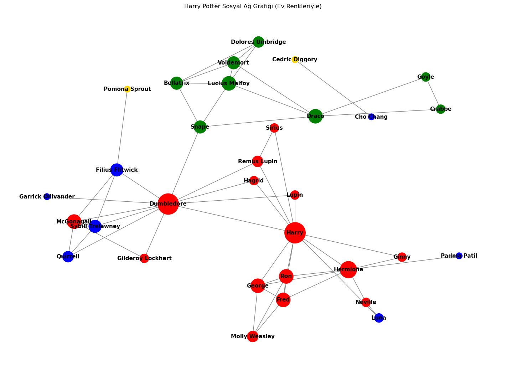
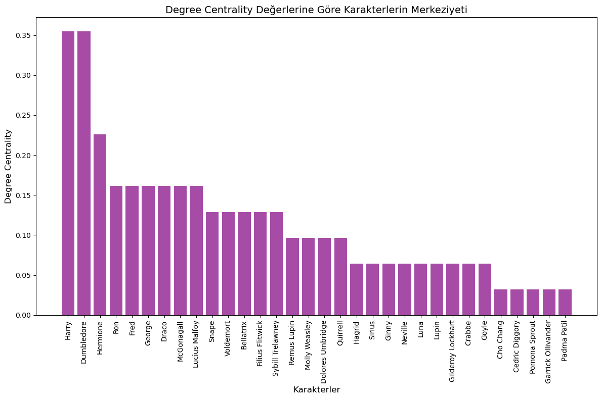
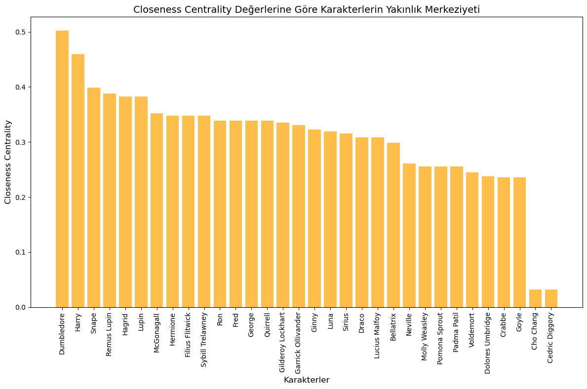
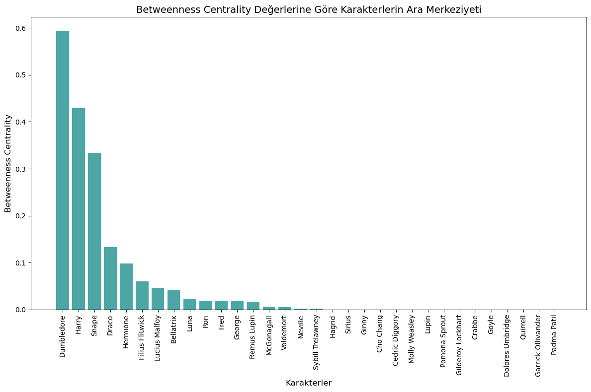
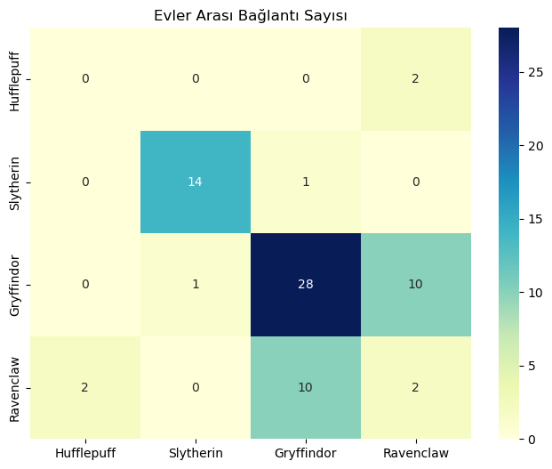

# Harry Potter Sosyal Ağ Analizi (Graf Teorisi)

Harry Potter film serisindeki karakterler arasındaki ilişkileri **graf teorisi** ile modelleyen ve **sosyal ağ analizi** metrikleriyle inceleyen bir Ayrık Matematik dersi projesi. Karakterler düğüm, aralarındaki arkadaşlık/yakınlık ilişkileri kenar olarak temsil edilir; hangi karakterin ağda ne kadar merkezi, köprü ya da izole bir konumda olduğu hesaplanıp görselleştirilir.



> Düğüm renkleri Hogwarts evlerini, düğüm boyutları *degree centrality* değerini gösterir (kırmızı: Gryffindor, yeşil: Slytherin, mavi: Ravenclaw, sarı: Hufflepuff).

## Ağ Özeti

| Özellik | Değer |
|---|---|
| Düğüm (karakter) sayısı | 32 |
| Kenar (ilişki) sayısı | 57 |
| Graf türü | Yönsüz, ağırlıksız |
| Ağ yoğunluğu | 0.115 |
| Ortalama kümelenme katsayısı | 0.571 |
| Bağlı bileşen sayısı | 2 (ana ağ + Cho Chang / Cedric Diggory ikilisi) |
| Ana bileşenin çapı | 6 |

## Yapılan Analizler

- **Degree Centrality:** En fazla doğrudan bağlantıya sahip karakterler. Harry ve Dumbledore 11'er bağlantıyla birinci sırada.
- **Closeness Centrality:** Ağdaki diğer karakterlere ortalama olarak en yakın olanlar. Dumbledore (0.502) ve Harry (0.460) öne çıkıyor.
- **Betweenness Centrality:** İki karakter arasındaki en kısa yollarda köprü görevi gören karakterler. Dumbledore (0.594), Harry (0.429) ve Snape (0.333) ağın en önemli köprüleri.
- **Bağlı bileşen analizi:** Ağın ana gövdeden kopuk alt kümelerinin tespiti.
- **Evler arası bağlantı matrisi:** Dört ev arasındaki ilişki sayıları ısı haritası ile gösterilir. Gryffindor kendi içinde (28) ve Ravenclaw ile (10) yoğun bağlantılıdır; Slytherin ağın geri kalanıyla neredeyse yalnızca Dumbledore–Snape kenarı üzerinden bağlanır.
- **Derece dağılımı:** Ağdaki bağlantı yoğunluğunun histogramı.

### Merkezilik Metrikleri

| Degree | Closeness | Betweenness |
|---|---|---|
|  |  |  |

### Evler Arası Bağlantılar



## Kullanılan Teknolojiler

- **Python 3**
- **NetworkX:** graf oluşturma ve merkezilik hesapları
- **Matplotlib / Seaborn:** görselleştirme
- **Pandas:** ev bağlantı matrisi
- **Jupyter Notebook**

## Proje Yapısı

```
HarryPotterGraph/
├── HarryPotter.ipynb         # Analiz ve görselleştirmelerin tamamı
├── Ayrık Matematik Rapor.docx # Proje raporu (problem tanımı, graf teorisi arka planı, bulgular)
├── docs/images/              # README'deki grafikler
└── README.md
```

## Çalıştırma

```bash
git clone https://github.com/MelihAliCagman/HarryPotterGraph.git
cd HarryPotterGraph

pip install networkx matplotlib seaborn pandas jupyter
jupyter notebook HarryPotter.ipynb
```

Notebook'taki hücreleri sırayla çalıştırın; veri harici bir dosyadan okunmaz, karakter ve ilişki listesi doğrudan notebook içinde tanımlıdır.

## Ekip

Üç kişilik ekiple Gazi Üniversitesi Bilgisayar Mühendisliği Ayrık Matematik dersi kapsamında geliştirilmiştir.

## Veri Hakkında Not

Karakterler ve ilişkiler, filmlerden yola çıkılarak elle hazırlanmış bir listedir; resmî bir veri seti değildir. Bu nedenle sonuçlar, seçilen karakter ve ilişkilere bağlıdır.
